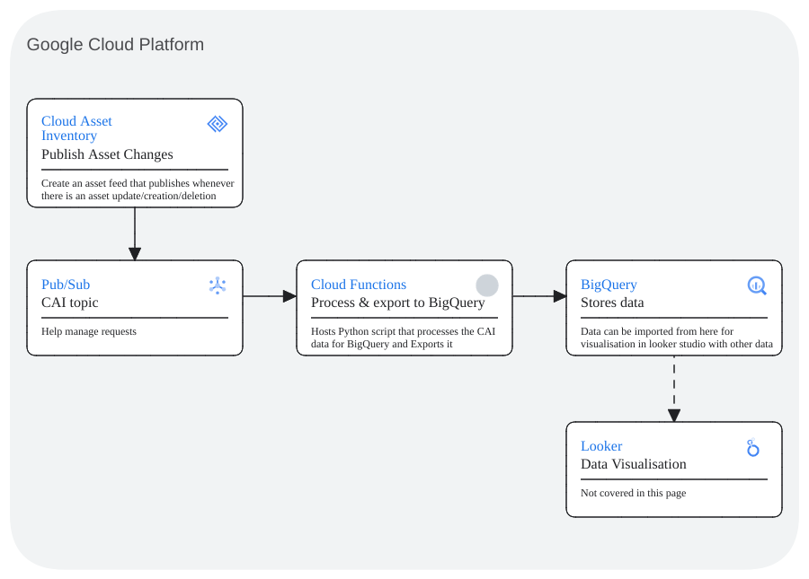

# Cloud Asset feed export to BigQuery script 

Within Google Cloud Platform, this is a guide to set up a cloud asset feed that uses pub/sub to trigger cloud function that exports feed data from cloud assets into bigquery.



## How it works
The script triggers when Cloud Assets Inventory feed sends a message to the pub/sub topic that the Cloud Function containing the script is subscribed to. 

From there it decodes the message and processes the data by removing [unsupported characters](https://cloud.google.com/bigquery/docs/schemas) and omitting empty json files as they are not supported in BigQuery

It then generates a schema from the data that is used when inserting the data into BigQuery. 

If the defined dataset or table within the script is not available, it will create them (This may result in an initial error when creating as it will try to insert the data into a non-existant dataset/table).

Lastly, it inserts the data into the table

## Pre-requisites
 - Enable Cloud Asset API & Cloud Resource Manager
 - Create a pub/sub topic
 - Service Account with the following roles:
    - Cloud Run Invoker
    - BigQuery Admin
    - Logs Writer
    - Storage Object Admin
    - Artifact Registry Create-on-Push Writer

## Setup

### Cloud Function
Cloud function once triggered will run the script that exports feed data from cloud assets into bigquery.

 - Under Cloud Functions, create a new function
 - Set the following in the setup page
    #### Basics
    - Environment: 2nd gen
    - Function name: name
    - Region: region
    #### Trigger
    - Trigger type: Cloud Pub/Sub
    - Cloud Pub/Sub topic: Create or use your already created topic
    - More Options/Service account: Select the service account with the roles mentioned in the pre-requisites section (Requires Cloud Run Invoker to trigger function)
    Runtime, build, connections and security settings
    - Runtime service account: Select the service account with the roles mentioned in the pre-requisites section
    - Select Next
    #### Code
    - Runtime: Python 3.12
    - Replace the main and the requirements with the files in this repo
    - You may test the function with the sample_body.txt as a reference
    - Deploy

### Cloud Assets
Cloud Assets creates a feed that sends a message to Pub/Sub whenever the stated asset is created, updated, deleted.

 - Open Cloud Shell (currently this is the only way to create a feed)
 - Run the following shell scipt to create a feed
    - You can specify a specific asset type but ".*.googleapis.com.*" handles all APIs
    - Additionally, you can specify different content-types ([reference](https://cloud.google.com/asset-inventory/docs/overview#content_types))
    - [Reference Documentation](https://cloud.google.com/asset-inventory/docs/monitoring-asset-changes)
 ```shell
 gcloud asset feeds create FEED_NAME-<content-type> --project <project-id>  --pubsub-topic projects/<project-id> /topics/<topic-name> --asset-types ".*.googleapis.com.*" --content-type  <content-type>
 ```

## Code

### Dependencies
These libraries are used within the function for the following reasons

```python
import base64
import json
import functions_framework
from datetime import datetime
from google.cloud import bigquery
from google.auth import default
```
| Library                   | Use case                                                 |
|---------------------------|----------------------------------------------------------|
| base64                    | decode message data                                      |
| json                      | format decoded data to json                              |
| base64                    | decode message data                                      |
| functions_framework       | retrieve the pub/sub message from cloud assets           |
| datetime                  | Identify timestamp data type when parsing json           |
| google.cloud.bigquery     | Access biqguery to create/insert dataset/table/data      |
| google.auth.default       | Get Project ID                                           |

### Initialize API Clients
Initialize with Application Default Credentials (ADC) and bigquery

```python
    # Initialize clients
    _, project_id = default()
    # Connect to BigQuery client
    client = bigquery.Client(project=project_id)
```

### Decoding data
cloud_event is passed into the function containing the message from the feed,
the following code decodes it back into a json that can be used.

```python
    # Decode message
    data_string = base64.b64decode(cloud_event.data["message"]["data"])
    data_string = data_string.decode('utf-8').strip("'")

    message_data = json.loads(data_string)
    message_body = message_data["asset"]
```

### Modify json to comply with biguery
The function recursively goes through the json to update key names with unsupported characters
and replaces them. Additionally, this also ommits any json that is empty or null
[Documentation](https://cloud.google.com/bigquery/docs/schemas)

```python
def modify_json_for_bq(nested_json):
    if isinstance(nested_json, dict):
        if nested_json == {}:
            return
        # Handle dictionaries:
        modified_dict = {}
        for key, value in nested_json.items():
            # Remove unsupported characters
            key = key.replace('.', '-')
            key = key.replace('/', '_')
            new_value = modify_json_for_bq(value)
            # Omit empty json, BQ does not support this
            if new_value is not None:
                modified_dict[key] = new_value
            else:
                print(f"Warning: Empty json [{key}] found, removing to comply with BigQuery")
        return modified_dict
    elif isinstance(nested_json, list):
        # Handle lists:
        return [modify_json_for_bq(item) for item in nested_json]
    else:
        # Handle other data types (no modification needed):
        return nested_json

# Main Function call
message_body = modify_json_for_bq(message_body)
```

### Recursively go through the json to generate a new schema and json body
The Function generates a schema from the provided Json data it is used together with the function in the following section

```python
# Recursive function to define schema
def generate_schema_from_json(data):
    schema = []
    # Define schema dynamically based on top-level data keys and nested data structure
    for key, value in data.items():
        key_type = get_key_type(value)
        key_mode = 'NULLABLE'
        nested_schema = []
        if key_type == 'LIST':
            # Set mode as Repeated to account for list
            key_mode='REPEATED'
            if len(value[0]) == 0:
                key_type = 'STRING'
            else:
                key_type = get_key_type(value[0])
            # Handle list
            if key_type == 'RECORD':
                nested_schema = generate_schema_from_json(value[0])
        elif key_type == 'RECORD':
            # Handle nested data (adjust data types for nested fields)
            nested_schema = generate_schema_from_json(value)
        if len(nested_schema) == 0:
            schema.append(bigquery.SchemaField(key, key_type, mode=key_mode))
        else:
            schema.append(bigquery.SchemaField(key, key_type, fields=nested_schema, mode=key_mode))
    return schema

# Main function call
schema = generate_schema_from_json(message_body)
```

### Returning a schema key value
This function determines the value type and returns the key type for the schema

```python
def get_key_type(value):
    if isinstance(value, bool):
        return 'BOOL'
    elif isinstance(value, int):
        return 'INTEGER'
    elif isinstance(value, float):
        return 'FLOAT64'
    elif isinstance(value, list):
        return 'LIST'
    elif isinstance(value, dict):
        if "type" in value and "coordinates" in value:
            return 'GEOGRAPHY'
        else:
            return 'RECORD'
    else:
        try:
            datetime.fromisoformat(value)
            return 'TIMESTAMP'
        except:
            return 'STRING'
```

### Get/Create BigQuery datasets and tables for the data to be imported to
Creates a dataset and table if not already available

```python
    # Seperate APIs into different datasets
    dataset_name = f"cai_dataset_{asset_api_name}" # Replace accordingly
    dataset_id = f"{project_id}.{dataset_name}"

    # Seperate assets into different tables
    table_name = f"cai_{asset_api_name}_{asset_name}" # Replace accordingly
    table_id = f"{dataset_id}.{table_name}"

    # Create/Set Dataset and table to export data to BigQuery
    dataset = client.create_dataset(dataset_id, exists_ok=True)
    table = bigquery.Table(table_id, schema=schema)
    client.create_table(table, exists_ok=True)
```
### Import data into BigQuery
Inserts data into BigQuery

```python
    rows = tuple(message_body.values())

    # Insert CAI data into BigQuery table
    errors = client.insert_rows(table, [rows])
    
    if errors:
        print(f"ERROR: while inserting {asset_api_name}.{asset_name} CAI data: {errors}")
    else:
        print(f"SUCCESS: {asset_api_name}.{asset_name} CAI data succesfully exported to big query")
```
