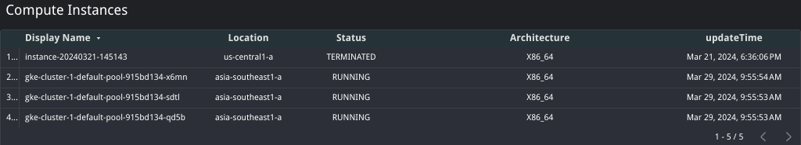

# Cloud Asset feed export to BigQuery script 

Within Google Cloud Platform, this is a guide to set up a cloud asset feed that uses pub/sub to trigger cloud function that exports feed data from cloud assets into bigquery.


## How it works
Cloud Scheduler triggers a cloud function through a pub/sub topic, which then calls the Cloud Asset API to export the data onto BigQuery (BigQuery dataset and table need to be created).
Looker studios can  then connect to the data for visualization.

## Pre-requisites
 - Enable the following APIs:
    - Cloud Scheduler API
    - Cloud Pub/Sub
    - Cloud Functions
    - Cloud Build
    - Cloud Asset API
    - Cloud Run Admin API
    - BigQuery API
    - Vloud Billing
    - BigQuery Data Transfer Service API 
    - Looker Studio API
 - Service Account with the following roles:
    - Cloud Run Invoker
    - Cloud Asset Viewer
    - BigQuery Data Editor

 - One time roles required for Billing export
    - Billing Account Costs Manager
    - Billing Account Administrator
 - Set [Billing data to export to BigQuery](https://cloud.google.com/billing/docs/how-to/export-data-bigquery-setup)

## Setup

### Big Query
Here, we will create a dataset for the asset data to be exported into.
 - On the left, select the options (the 3 dots) next to your project 
 - Select 'Create data set'
 - Fill in the data set ID and select 'Create Data Set'

### Pub/Sub
Pub/sub helps manages messages between the scheduler and cloud functions.

 - Select 'Create Topic' and enter a topic name in 'Topic ID'
 - Select Create

### Cloud Function
Cloud function once triggered will run the script that exports data from cloud assets into bigquery.

 - Under Cloud Functions, create a new function
 - Set the following in the setup page
    #### Basics
    - Environment: 2nd gen
    - Function name: name
    - Region: region
    #### Trigger
    - Trigger type: Cloud Pub/Sub
    - Cloud Pub/Sub topic: Create or use your already created topic
    - More Options/Service account: Select the service account with the roles mentioned in the pre-requisites section (Requires Cloud Run Invoker to trigger function)
    Runtime, build, connections and security settings
    - Runtime service account: Select the service account with the roles mentioned in the pre-requisites section
    - Select Next
    #### Code
    - Runtime: Python 3.12
    - Replace the main and the requirements with the files in this repo
    - Change the dataset_name and table_name in the code to the dataset and table previously created
    - Deploy

### Cloud Scheduler
Cloud Scheduler triggers the Cloud function previously created through Pub/Sub.

 - Under Cloud Scheduler, create a new job
 - Set the following in the setup page
    #### Define the schedule
    - Name: name
    - Region: region
    - Frequency: frequency or trigger
    - Timezone: Timezone referenced in Frequency
    #### Configure the execution
    - Target type: Pub/Sub
    - Cloud Pub/Sub topic: Topic used in Cloud Function
    - Create

You may Force Trigger to test the scheduler

### Billing
Exports the billing data periodically to the data set
- Select 'Go to the Billing export page'
- At the prompt, choose the Cloud Billing account for which you'd like to export billing data. The Billing export page opens for the selected billing account.
- On the BigQuery export tab, click Edit settings for each type of data you'd like to export. Each type of data is configured separately.
- From the Projects list, select the project that you set up to contain your BigQuery dataset.
- From the Dataset ID field, select the dataset that you set up to contain your exported Cloud Billing data.

## Code
This section goes through the script used to export asset data to BigQuery

### Dependencies
These libraries are used within the function for the following reasons
```python
import functions_framework
import requests
from google.cloud import bigquery
from google.cloud import asset_v1
from google.auth import default
```
| Library                   | Use case                                                 |
|---------------------------|----------------------------------------------------------|
| functions_framework       | retrieve the pub/sub message from cloud scheduler        |
| requests                  | requests made to asset api                               |
| bigquery                  | Creating BigQuery datasets                               |
| asset_v1                  | Make calls to Asset Inventory to export to BigQuery      |
| default                   | Provide default authorization                            |

### Initialize API Clients

Initializes the Asset Inventory and BigQuery API Clients, the following code also applies Application Default Credentials (ADC)
```python
# Triggered from a message on a Cloud Pub/Sub topic.
_, project_id = default()

# Connect to clients
asset_client = asset_v1.AssetServiceClient()
bq_client = bigquery.Client(project=project_id)
```

### Setting Variables
Set the name of the dataset to export to, if the database does not exist, it creates one for you
```python
  # Set Dataset and table to export data to BigQuery
  dataset_name = "cai_dataset" # Replace accordingly
  dataset_id = f"{project_id}.{dataset_name}"
  # If Dataset was not created, it will create it
  dataset = bq_client.create_dataset(dataset_id, exists_ok=True)
```

### Exporting Asset data to BigQuery
For reference, you may refer to the documentation in these links [code](https://cloud.google.com/asset-inventory/docs/samples/asset-quickstart-export-assets-bigquery) [documentation](https://cloud.google.com/asset-inventory/docs/exporting-to-bigquery)
#### Output config
The following creates an output_config that is used in the request to export the data into BigQuery:
 - dataset: The path of the dataset in the following format
 ```
 "projects/{project_id}/datasets/{dataset_name}"
 ```
 - table: The name of the table to export to
 - force: This sets whether the data overwrites and existing data in the table 
 - separate_tables_per_asset_type": This determines whether the exported data will be generically exported into 1 table if false or seperated into individual tables by assets if true. 
 
 Tables seperated by assets will automatically output more columns of data that can be easily queried by SQL as compared to the single table which combines the additional data into a string to conform to a generic schema
```python
    output_config = asset_v1.OutputConfig()
    output_config.bigquery_destination.dataset = f"{parent}/datasets/{dataset_name}"
    output_config.bigquery_destination.table = table_name
    output_config.bigquery_destination.force = True
    output_config.bigquery_destination.separate_tables_per_asset_type = True
```

#### Request & Exporting of assets
This sends the request to asset inventory to export the data to BigQuery,
the output_config is taken from the previous part and content_type determines what kind of content to be exported, in the code it is set in a list that uses a for loop to output multiple content types.
Available [content types](https://cloud.google.com/asset-inventory/docs/overview#content_types): 
"RESOURCE","RELATIONSHIP","IAM_POLICY","ORG_POLICY","ACCESS_POLICY","OS_INVENTORY"
```python
   parent = f"projects/{project_id}"   
    request=asset_v1.ExportAssetsRequest(
      parent =  parent,
      content_type = content,
      output_config = output_config
    )
   response = asset_client.export_assets(request=request)
```

## Looker Studios
### Dashboard Setup
#### Creating a report and adding data
- On [Looker Studios](https://lookerstudio.google.com/), create a blank report.
- Select BigQuery.
- From here, you can either grab the table as is, or you can use CUSTOM QUERY to create data using an SQL call. [Additional info](https://support.google.com/looker-studio/answer/6370296?hl=en&ref_topic=10587734&sjid=4576648556961219928-AP#zippy=%2Cin-this-article)
- You can add more data by selecting the 'Add Data' option in the Data tab and repeating the previous steps.
- To set the freshness of the data go to the Resource tab and select 'Manage added data sources', edit the selected table and change the data freshness tab at the top accordingly.
#### Adding or modifying fields
- You can further modify the data through [calculated fields](https://support.google.com/looker-studio/answer/9152828?hl=en), you can find a function list [here](https://support.google.com/looker-studio/table/6379764?hl=en)
#### Data Visualisations
- Refer to the following for the dashboard setup:
   - [Charts](https://support.google.com/looker-studio/answer/6293184#zippy=%2Cin-this-article)
   - [Share](https://support.google.com/looker-studio/answer/6296080?hl=en&ref_topic=6289358&sjid=4576648556961219928-AP#zippy=%2Cin-this-article)
#### Adding Pages
- Select the 'page' tab and select 'new page' to create a new page
- Select the 'page' tab and select 'manage pages' to manage pages created (change order, rename, etc.)
#### Themes and layout
- You can select the 'Theme and layout' to select a theme of your choosing
- You can also selct shapes to organize your charts

For additional information on Looker Studio refer to this [link](https://support.google.com/looker-studio/topic/9170843?hl=en&ref_topic=12398462&sjid=4576648556961219928-AP)

### Dashboard Templates
In this section we'll go through how you can create some of the following dashboards from the data generated above.
Follow the instructions in the previous section to create a report and add the table data for the respective sections.

#### Billing
This sections shows how you can create a dashboard to keep track of spending


|Table used                                            |
|------------------------------------------------------|
| gcp_billing_export_v1_<BILLING_ACCOUNT_ID>           |


- Select data source as 'gcp_billing_export_v1_<BILLING_ACCOUNT_ID>'
- Select the 'Add a chart' tab, and select the 'Donut chart'
- Under dimension, select 'project.id'
- Under metric, select 'cost'
- You can add text to title the chart


- Select data source as 'gcp_billing_export_v1_<BILLING_ACCOUNT_ID>'
- Select the 'Add a chart' tab, and select the 'bar chart'
- Under dimension, select 'service.description'
- Under metric, select 'cost'
- You can add text to title the chart


- Select data source as 'gcp_billing_export_v1_<BILLING_ACCOUNT_ID>'
- Select the 'Add a chart' tab, and select the 'stacked column chart'
- Under dimension, select 'tags.key'
- Under breakdown dimension, select 'tags.value'
- Under metric, select 'cost'
- At the bottom of properties, select 'Add a filter' and 'Create a filter'
- Set the filter to 'exclude' 'tags.key' 'Equal to (=)' 'NULL' (This removes any resources that are not tagged)
- You can add text to title the chart


- Select data source as 'gcp_billing_export_v1_<BILLING_ACCOUNT_ID>'
- Select the 'Add a chart' tab, and select the 'time series chart'
- Under dimension, select 'export_time(Date)'
- Under metric, select 'cost'
- You can add text to title the chart


- Select data source as 'gcp_billing_export_v1_<BILLING_ACCOUNT_ID>'
- Select the 'Add a chart' tab, and select the 'Scorecard'
- Under metric, select 'cost'
- You can add text to title the chart


- Select data source as 'gcp_billing_export_v1_<BILLING_ACCOUNT_ID>'
- Select the 'Add a chart' tab, and select the 'stacked column chart'
- Under dimension, select 'invoice.month'
- Under breakdown dimension, select 'service.description'
- Under metric, select 'cost'
- Under sort, select 'invoice.month' and select ascending
- You can add text to title the chart


- Select data source as 'gcp_billing_export_v1_<BILLING_ACCOUNT_ID>'
- Select the 'Add a control' tab, and select the 'date range control'
- Select the 'Add a control' tab, and select the 'drop-down list'
   - From there you can select a field as the control field

#### Asset Overview
This section shows how you can create a dashboard to keep track of multiple assets


|Table used      |
|----------------|
| <content_type> |
| resource       |

This table is created by setting the 'separate_tables_per_asset_type' to False in the code above.
Doing so generates a table that is an amalgamation of all asset types


- Select data source as 'resource'
- Select the 'Add a chart' tab, and select the 'bar chart'
- Under dimension, select 'asset_type'
- Under metric, select 'resource.data'
- You can add text to title the chart


- Select data source as 'resource'
- Select the 'Add a chart' tab, and select the 'pie chart'
- Under dimension, select 'resource.location'
- Under metric, select 'name'
- You can add text to title the chart


- Select data source as 'resource'
- Select the 'Add a chart' tab, and select the 'Donut chart'
- Under dimension, select 'resource.discovery_name'
- Under metric, select 'Record Count'
- You can add text to title the chart


- Select data source as 'resource'
- Select the 'Add a chart' tab, and select the 'table'
- Under dimension, select 'name'
- Add dimension and select 'resource.location'
- Do the following for any additional fields you want to see
- You can add text to title the chart


#### Resource specific dashboard (Compute)
This section shows how you can create a dashboard for specific asset types


|Table used                                            |                                          |
|------------------------------------------------------|------------------------------------------| 
| <content-type>_<service>_googleapis_com_<asset-type> | resource_compute_googleapis_com_instance |
| gcp_billing_export_v1_<BILLING_ACCOUNT_ID>           |                                          |

This table is created by setting the 'separate_tables_per_asset_type' to True in the code above.
Doing so generates multiple tables of varying asset types with more data being seperated into more columns


- Select data source as 'gcp_billing_export_v1_<BILLING_ACCOUNT_ID>'
- Select the 'Add a chart' tab, and select the 'stacked column chart'
- Under dimension, select 'tags.key'
- Under breakdown dimension, select 'tags.value'
- Under metric, select 'cost'
- At the bottom of properties, select 'Add a filter' and 'Create a filter'
- Set the filter to 'include' 'service.description' 'Equal to (=)' 'Compute Engine'
- Select 'AND' 'exclude' 'tags.key' 'Equal to (=)' 'NULL' (This removes any resources that are not tagged)
- You can add text to title the chart


- Select data source as 'resource_compute_googleapis_com_Instance'
- Select the 'Add a chart' tab, and select the 'bar chart'
- Select 'Add a field' and input the following into the Formula and set the 'Field Name' as 'Machine Type'
```SQL
REGEXP_EXTRACT(resource.data.machineType, "/([\\w\\.-]+)$")
```
- Under dimension, select 'Machine Type'
- Under metric, select 'Machine Type'
- You can add text to title the chart


- Select data source as 'resource_compute_googleapis_com_Instance'
- Select the 'Add a chart' tab, and select the 'Donut chart'
- Under dimension, select 'resource.data.status'
- Under metric, select 'Record Count'
- You can add text to title the chart


- Select data source as 'resource_compute_googleapis_com_Instance'
- Select the 'Add a chart' tab, and select the 'Donut chart'
- Under dimension, select 'resource.location'
- Under metric, select 'Record Count'
- You can add text to title the chart


- Select data source as 'resource_compute_googleapis_com_Instance'
- Select the 'Add a chart' tab, and select the 'table'
- Select 'Add a field' and input the following into the Formula and set the 'Field Name' as 'Display Type'
```SQL
REGEXP_EXTRACT(name, "/([\\w\\.-]+)$")
```
- Under dimension, select 'Display Type'
- Add dimension and select 'resource.location'
- Do the following for any additional fields you want to see
- You can add text to title the chart


- Select data source as 'gcp_billing_export_v1_<BILLING_ACCOUNT_ID>'
- Select the 'Add a chart' tab, and select the 'Scorecard'
- Under metric, select 'cost'
- At the bottom of properties, select 'Add a filter' and 'Create a filter'
- Set the filter to 'include' 'service.description' 'Equal to (=)' 'Compute Engine'
- You can add text to title the chart