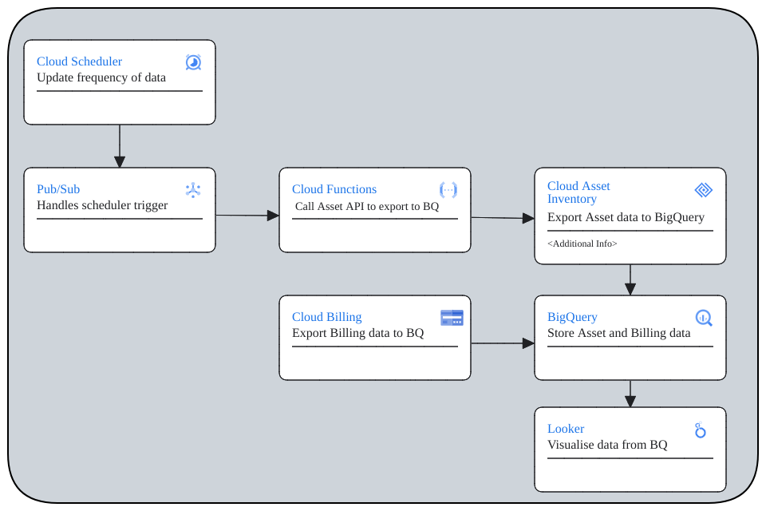

# Cloud Asset feed export to BigQuery script 

Within Google Cloud Platform, this is a guide to set up a cloud asset feed that uses pub/sub to trigger cloud function that exports feed data from cloud assets into bigquery.



## How it works
Cloud Scheduler triggers a cloud function through a pub/sub topic, which then calls the Cloud Asset API to export the data onto BigQuery (BigQuery dataset and table need to be created).
Looker studios can  then connect to the data for visualization.

## Pre-requisites
 - Enable Cloud Asset API & Cloud Resource Manager
 - Service Account with the following roles:
    - Cloud Run Invoker
    - BigQuery Admin
    - Logs Writer
    - Storage Object Admin
    - Artifact Registry Create-on-Push Writer
 - Create a pub/sub topic
 - Cloud Scheduler that pushes to the created topic (frequency of update)

## Setup

### Cloud Function
Cloud function once triggered will run the script that exports data from cloud assets into bigquery.

 - Under Cloud Functions, create a new function
 - Set the following in the setup page
    #### Basics
    - Environment: 2nd gen
    - Function name: name
    - Region: region
    #### Trigger
    - Trigger type: Cloud Pub/Sub
    - Cloud Pub/Sub topic: Create or use your already created topic
    - More Options/Service account: Select the service account with the roles mentioned in the pre-requisites section (Requires Cloud Run Invoker to trigger function)
    Runtime, build, connections and security settings
    - Runtime service account: Select the service account with the roles mentioned in the pre-requisites section
    - Select Next
    #### Code
    - Runtime: Python 3.12
    - Replace the main and the requirements with the files in this repo
    - Change the dataset_name and table_name in the code to the dataset and table previously created
    - Deploy

## Code
This section goes through the script used to export asset data to BigQuery

### Dependencies
These libraries are used within the function for the following reasons
```python
import functions_framework
import requests
from google.cloud import bigquery
from google.cloud import asset_v1
from google.auth import default
```
| Library                   | Use case                                                 |
|---------------------------|----------------------------------------------------------|
| functions_framework       | retrieve the pub/sub message from cloud scheduler        |
| requests                  | requests made to asset api                               |
| bigquery                  | Creating BigQuery datasets                               |
| asset_v1                  | Make calls to Asset Inventory to export to BigQuery      |
| default                   | Provide default authorization                            |

### Initialize API Clients

Initializes the Asset Inventory and BigQuery API Clients, the following code also applies Application Default Credentials (ADC)
```python
# Triggered from a message on a Cloud Pub/Sub topic.
_, project_id = default()

# Connect to clients
asset_client = asset_v1.AssetServiceClient()
bq_client = bigquery.Client(project=project_id)
```

### Setting Variables
Set the name of the dataset to export to, if the database does not exist, it creates one for you
```python
  # Set Dataset and table to export data to BigQuery
  dataset_name = "cai_dataset" # Replace accordingly
  dataset_id = f"{project_id}.{dataset_name}"
  # If Dataset was not created, it will create it
  dataset = bq_client.create_dataset(dataset_id, exists_ok=True)
```

### Exporting Asset data to BigQuery
For reference, you may refer to the documentation in these links [code](https://cloud.google.com/asset-inventory/docs/samples/asset-quickstart-export-assets-bigquery) [documentation](https://cloud.google.com/asset-inventory/docs/exporting-to-bigquery)
#### Output config
The following creates an output_config that is used in the request to export the data into BigQuery:
 - dataset: The path of the dataset in the following format
 ```
 "projects/{project_id}/datasets/{dataset_name}"
 ```
 - table: The name of the table to export to
 - force: This sets whether the data overwrites and existing data in the table 
 - separate_tables_per_asset_type": This determines whether the exported data will be generically exported into 1 table if false or seperated into individual tables by assets if true. 
 
 Tables seperated by assets will automatically output more columns of data that can be easily queried by SQL as compared to the single table which combines the additional data into a string to conform to a generic schema
```python
    output_config = asset_v1.OutputConfig()
    output_config.bigquery_destination.dataset = f"{parent}/datasets/{dataset_name}"
    output_config.bigquery_destination.table = table_name
    output_config.bigquery_destination.force = True
    output_config.bigquery_destination.separate_tables_per_asset_type = True
```

#### Request & Exporting of assets
This sends the request to asset inventory to export the data to BigQuery,
the output_config is taken from the previous part and content_type determines what kind of content to be exported, in the code it is set in a list that uses a for loop to output multiple content types.
Available [content types](https://cloud.google.com/asset-inventory/docs/overview#content_types): 
"RESOURCE","RELATIONSHIP","IAM_POLICY","ORG_POLICY","ACCESS_POLICY","OS_INVENTORY"
```python
   parent = f"projects/{project_id}"   
    request=asset_v1.ExportAssetsRequest(
      parent =  parent,
      content_type = content,
      output_config = output_config
    )
   response = asset_client.export_assets(request=request)
```