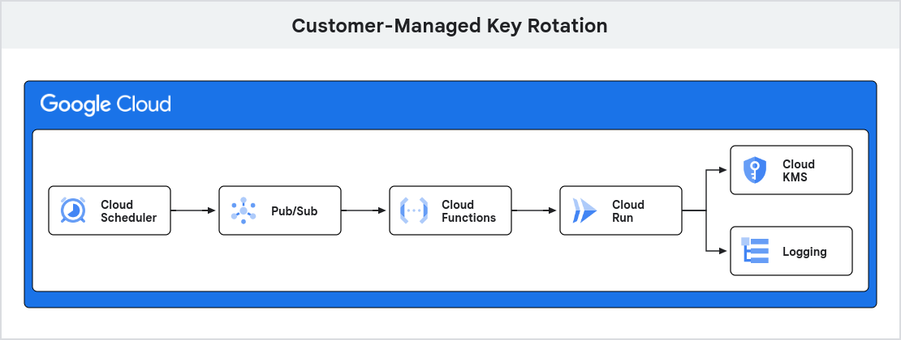

# CMEK Rotation script for log buckets using cloud function

Within Google Cloud Platform, this is a guide to set up a cloud scheduler that uses pub/sub to trigger cloud function that manually rotates a given cmek and updates given log buckets that use the rotate cmek with the latest key version.




## Pre-requisites
 - Customer managed encryption key (CMEK)
 - Secondary CMEK
 - CMEK enabled Logging bucket
 - Pub/Sub Topic
 - Service Account with the following roles:
    - Cloud Run Invoker
    - Cloud KMS Admin
    - Cloud KMS CryptoKey Encrypter/Decrypter
    - Logging Admin

## Setup

### Cloud Function
Cloud function once triggered will run the script that manually rotates the cmek and updates the stated bucket 

 - Under Cloud Functions, create a new function
 - Set the following in the setup page
    #### Basics
    - Environment: 2nd gen
    - Function name: name
    - Region: region
    #### Trigger
    - Trigger type: Cloud Pub/Sub
    - Cloud Pub/Sub topic: Create or use your already created topic
    - More Options/Service account: Select the service account with the roles mentioned in the pre-requisites section (Requires Cloud Run Invoker to trigger function)
    Runtime, build, connections and security settings
    - Runtime service account: Select the service account with the roles mentioned in the pre-requisites section
    - Select Next
    #### Code
    - Runtime: Python 3.12
    - Replace the main and the requirements with the files in this repo
    - You may test the function with the sample_body.txt as a reference
    - Deploy

### Cloud Scheduler
Cloud Scheduler triggers the Cloud function previously created through Pub/Sub.

 - Under Cloud Scheduler, create a new job
 - Set the following in the setup page
    #### Define the schedule
    - Name: name
    - Region: region
    - Frequency: frequency or trigger
    - Timezone: Timezone referenced in Frequency
    #### Configure the execution
    - Target type: Pub/Sub
    - Cloud Pub/Sub topic: Topic used in Cloud Function
    - Message body: refer to sample_body.txt and edit accordingly
    - Create

You may Force Trigger to test the scheduler

## Code

### Dependencies
These libraries are used within the function for the following reasons

```python
import base64
import json
import functions_framework
import time
import google.cloud.kms_v1 as kms
import googleapiclient.discovery
```
| Library                   | Use case                                                 |
|---------------------------|----------------------------------------------------------|
| base64                    | decode message data                                      |
| json                      | format decoded data to json                              |
| base64                    | decode message data                                      |
| functions_framework       | retrieve the pub/sub message from cloud scheduler        |
| time                      | sleep function to wait for primary key to finish updating|
| google.cloud.kms_v1       | Access key management service to update cmek             |
| googleapiclient.discovery | Access logging api to update log buckets                 |

### Initialize API Clients
Aside from initializing the KMS and logging API Clients, the following code also applies Application Default Credentials (ADC)

```python
# Initialize clients
kms_client = kms.KeyManagementServiceClient()    
logging_client = googleapiclient.discovery.build('logging', 'v2')
```

### Decoding data
cloud_event is passed into the function containing the message from the scheduler,
the following code decodes it back into variables that can be used

```python
# Decode message
data_string = base64.b64decode(cloud_event.data["message"]["data"])
data_string = data_string.decode('utf-8').strip("'")
message_data = json.loads(data_string)

# Variables
projectId = message_data['message']['project-id']
location = message_data["message"]["location"]
keyring = message_data["message"]["keyring"]
cmek = message_data["message"]["cmek"]
dummy_cmek = message_data["message"]["dummy_cmek"]
bucket = message_data["message"]["bucket"]
```

### Manually Rotating CMEK
This section rotates the given cmek and updates the cmek to use the new version as its primary

```python
# Set key path
key_path=f"projects/{projectId}/locations/{location}/keyRings/{keyring}/cryptoKeys/{cmek}"
dummy_key_path=f"projects/{projectId}/locations/{location}/keyRings/{keyring}/cryptoKeys/{dummy_cmek}"

# Create new version of key
print( f"Beginning rotation of CMEK: [{cmek}]")
new_key = kms_client.create_crypto_key_version(request={"parent": key_path})
version_id = new_key.name.split('cryptoKeyVersions/',1)[1]
# Set new version of key as primary
new_primary = kms_client.update_crypto_key_primary_version(request={"name": key_path, "crypto_key_version_id": version_id})
time.sleep(60)
print( f"CMEK: [{cmek}] succesfully rotated")
```

### Updating the CMEK enabled Log Bucket
The following code updates the Log Bucket with a CMEK, a secondary cmek is applied to the log bucket first before re-applying the primary cmek with the latest key to the log bucket, this is done the log bucket cannot be updated to use the newer version of a cmek that is currently in use.
[Reference documentation](https://cloud.google.com/logging/docs/routing/managed-encryption-storage)

```python
# Create the bucket update request body
bucket_body = {
    "name": bucket,
    "cmekSettings": {
        "kmsKeyName": dummy_key_path
    }
}

# Execute the API request to update the log bucket
request = logging_client.projects().locations().buckets().patch(
    name=f"projects/{projectId}/locations/{location}/buckets/{bucket}",
    body=bucket_body,
    updateMask="cmekSettings"  # Update only the CMEK key settings
)
response = request.execute()

print(f"Log bucket updated successfully: {response}")
```