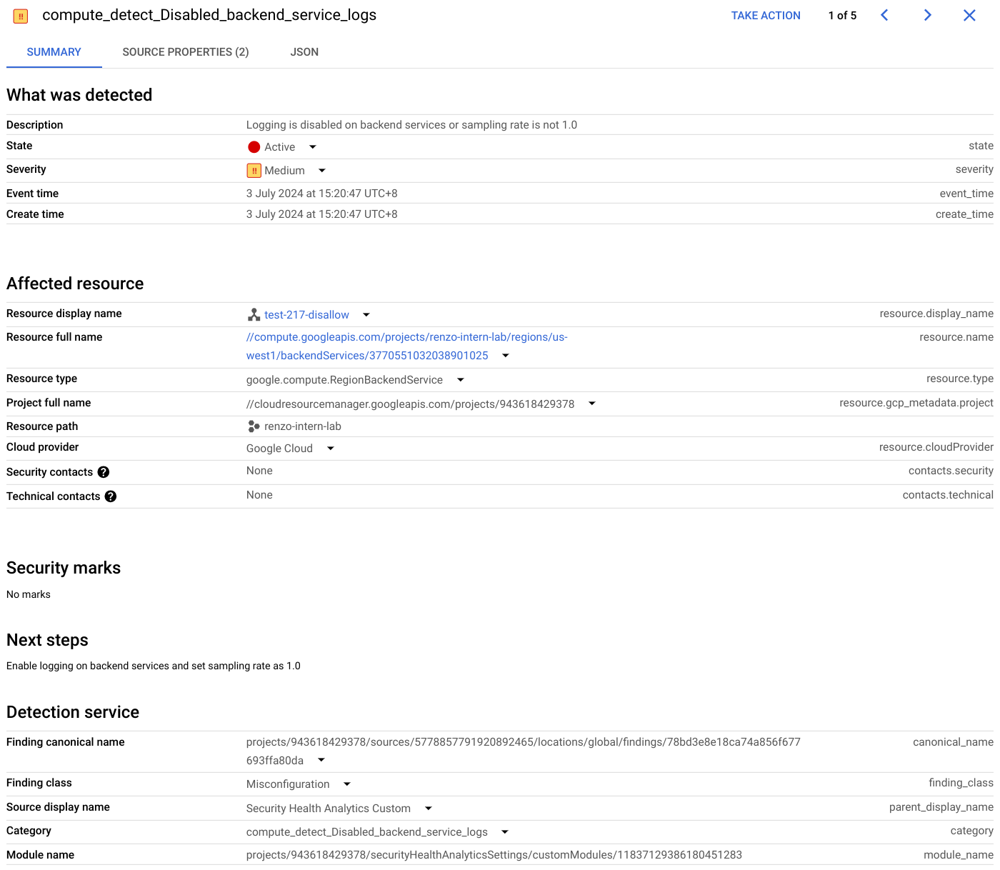

# Security Command Center BQ export Looker Dashboard

Within Google Cloud Platform, this is a guide to set up a Security Command Center feed export to BigQuery for Looker visualization.


## How it works
Security Command Center will export findings in near real-time to BigQuery. Looker studios can  then connect to the data for visualization.

## Setup

### Big Query
Here, we will create a dataset for the asset data to be exported into.
 - On the left, select the options (the 3 dots) next to your project 
 - Select 'Create data set'
 - Fill in the data set ID and select 'Create Data Set'

### Security Command Center
Allows custom security controls to trigger findings that are automatically created for high-risk cloud misconfigurations, vulnerabilities, and threats.


Sample Finding

#### Creating Custom Security Health (SHA) Modules through GUI

 - Open the [Security Command Center](https://console.cloud.google.com/projectselector2/apis/library?_ga=2.110465920.469691287.1719888900-1081903127.1718684112&_gac=1.48758484.1720010318.Cj0KCQjw7ZO0BhDYARIsAFttkCi4BbQ9wfweXd3nksykYO1csYAvmkVYO9Jx2kb34Vkmp0zuKtrY86saAr7QEALw_wcB) on your gcp console
 - Open the settings on the top right and under the 'Security Health Analytics' card, select 'MANAGE SETTINGS'
 - Select the 'MODULES' tab, and you should see all the controls available for your project.
 - Select 'Create Module' to create a custom module.
 - Enter the Module name, and select the resource type you want to monitor. ([resource types available](https://cloud.google.com/security-command-center/docs/custom-modules-sha-overview#supported-resource-types))
   - Multiple resource types are supported for one module
 - Under the 'Expressions editor', you can write [CEL expressions](https://cloud.google.com/security-command-center/docs/custom-modules-sha-code?_ga=2.79891223.-1081903127.1718684112#example_cel_expressions), to define the detection logic of the asset properties of the [resource types](https://cloud.google.com/security-command-center/docs/custom-modules-sha-overview#supported-resource-types)
   - Asset properties, can be seen by going to the resource types link and selecting the resource. The asset properties, are shown in the json, with descriptions below them
   - Additional documentation for CEL can be found [here](https://github.com/google/cel-spec/blob/master/doc/langdef.md)
   - Sample expression
   ```
   (!resource.logConfig.enable || resource.logConfig.sampleRate != 1.0)
   ```
 - Select 'Next', the next page, will allow you to define the severity of the finding, as well as the finding description and next steps
 - Select 'Create', depending on the resource type, it may take a few minutes to be active (about 10 mins on average)

#### Create Security Health Analytic (SHA) Modules through yaml files

```
severity: Medium
description: "Logging is disabled on backend services or sampling rate is not 1.0"
recommendation: "Enable logging on backend services and set sampling rate as 1.0""
resource_selector:
  resource_types:
  - compute.googleapis.com/BackendService
  - compute.googleapis.com/RegionBackendService
predicate:
  expression: !resource.logConfig.enable || resource.logConfig.sampleRate != 1.0
```
Sample yaml can be found in the same repo under sample_yaml_file.yaml

 - The above is a template for a yaml file for creating security health analytics modules
 - Replace the severity, description, recommendation, resource_types and expression
 - Once done, open the [Google Cloud Shell](https://console.cloud.google.com/projectselector2?_ga=2.143144752.469691287.1719888900-1081903127.1718684112&_gac=1.121454074.1720010318.Cj0KCQjw7ZO0BhDYARIsAFttkCi4BbQ9wfweXd3nksykYO1csYAvmkVYO9Jx2kb34Vkmp0zuKtrY86saAr7QEALw_wcB) and change the directory to the location of the yaml file.
  - To upload the file, you can select the option button (3 vertical dots) and select 'Upload', to upload the yaml file.
 - Run the following command in the cloud shell to create the sha module.
 ```
 gcloud scc custom-modules sha create --project={Project ID} --display-name={Module Name} --enablement-state="enabled" --custom-config-from-file={Yaml File}
 ```

#### Setup stream to export findings to BigQuery
Setup a findings stream to BigQuery for analytics over vast amounts of data in near real time.

 - In the [Google Cloud Shell](https://console.cloud.google.com/projectselector2?_ga=2.143144752.469691287.1719888900-1081903127.1718684112&_gac=1.121454074.1720010318.Cj0KCQjw7ZO0BhDYARIsAFttkCi4BbQ9wfweXd3nksykYO1csYAvmkVYO9Jx2kb34Vkmp0zuKtrY86saAr7QEALw_wcB), run the following command to create the stream
```
   gcloud scc bqexports create {ExportName} --dataset=projects/{ProjectID}/datasets/{Dataset Name} --project={ProjectID}
```
Sample json can be found in the same repo under sample_finding_json.yaml

## Looker Studios
### Dashboard Setup
#### Creating a report and adding data
- On [Looker Studios](https://lookerstudio.google.com/), create a blank report.
- Select BigQuery.
- From here, you can either grab the table as is, or you can use CUSTOM QUERY to create data using an SQL call. [Additional info](https://support.google.com/looker-studio/answer/6370296?hl=en&ref_topic=10587734&sjid=4576648556961219928-AP#zippy=%2Cin-this-article)
- You can add more data by selecting the 'Add Data' option in the Data tab and repeating the previous steps.
- To set the freshness of the data go to the Resource tab and select 'Manage added data sources', edit the selected table and change the data freshness tab at the top accordingly.
#### Adding or modifying fields
- You can further modify the data through [calculated fields](https://support.google.com/looker-studio/answer/9152828?hl=en), you can find a function list [here](https://support.google.com/looker-studio/table/6379764?hl=en)
#### Data Visualisations
- Refer to the following for the dashboard setup:
   - [Charts](https://support.google.com/looker-studio/answer/6293184#zippy=%2Cin-this-article)
   - [Share](https://support.google.com/looker-studio/answer/6296080?hl=en&ref_topic=6289358&sjid=4576648556961219928-AP#zippy=%2Cin-this-article)
#### Adding Pages
- Select the 'page' tab and select 'new page' to create a new page
- Select the 'page' tab and select 'manage pages' to manage pages created (change order, rename, etc.)
#### Themes and layout
- You can select the 'Theme and layout' to select a theme of your choosing
- You can also selct shapes to organize your charts

For additional information on Looker Studio refer to this [link](https://support.google.com/looker-studio/topic/9170843?hl=en&ref_topic=12398462&sjid=4576648556961219928-AP)

### Dashboard Templates
In this section we'll go through how you can create some of the following dashboards from the data generated above.
Follow the instructions in the previous section to create a report and add the table data for the respective sections.

