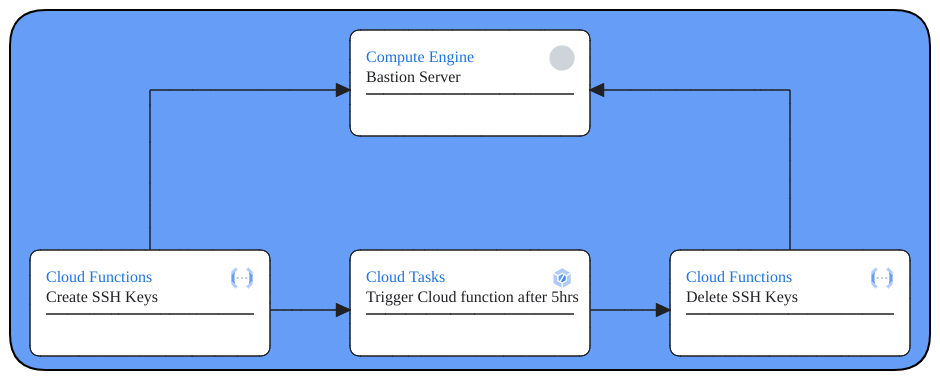

# Temporary Resource deletion 

Within Google Cloud Platform, this is a guide to set up a timed deletion of resources after creation using cloud tasks and cloud functions

## Pre-requisites
 - Pub/Sub Topic
 - Service Account with the following roles:
    - Cloud Run Invoker
    - Cloud Run Service Agent
    - Cloud Tasks Admin
    - Storage Admin

## Setup

### Cloud Function
Two Cloud functions will be created for this, 1 for deleting resources, and 1 for creating resources as well as creating a scheduled task to call the former function

 - Under Cloud Functions, create a new function
 - Set the following in the setup page
    #### Basics
    - Environment: 2nd gen
    - Function name: name
    - Region: region
    #### Trigger
    - Trigger type: Cloud Pub/Sub
    - Cloud Pub/Sub topic: Create or use your already created topic
    - More Options/Service account: Select the service account with the roles mentioned in the pre-requisites section (Requires Cloud Run Invoker to trigger function)
    Runtime, build, connections and security settings
    - Runtime service account: Select the service account with the roles mentioned in the pre-requisites section
    - Select Next
    #### Code
    - Runtime: Python 3.12
    - Replace the main and the requirements with the files in this repo
    - Deploy

### Cloud Scheduler
Cloud Scheduler triggers the Cloud function previously created through Pub/Sub.
(If you have an alternate way to trigger the first cloud function skip this step)

 - Under Cloud Scheduler, create a new job
 - Set the following in the setup page
    #### Define the schedule
    - Name: name
    - Region: region
    - Frequency: frequency or trigger
    - Timezone: Timezone referenced in Frequency
    #### Configure the execution
    - Target type: Pub/Sub
    - Cloud Pub/Sub topic: Topic used in Cloud Function
    - Message body: refer to sample_body.txt and edit accordingly
    - Create

You may Force Trigger to test the scheduler

## Code (TBD)